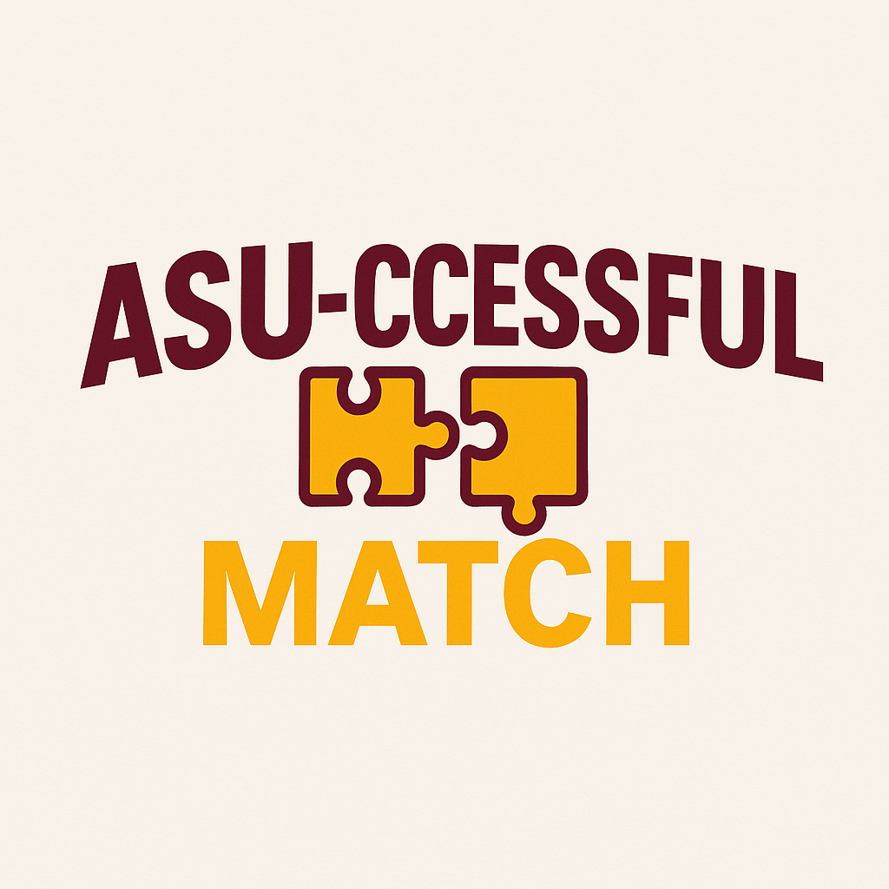
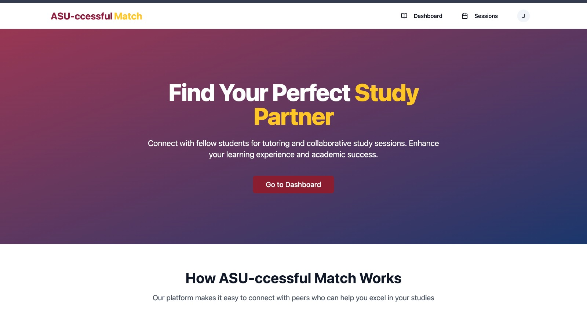
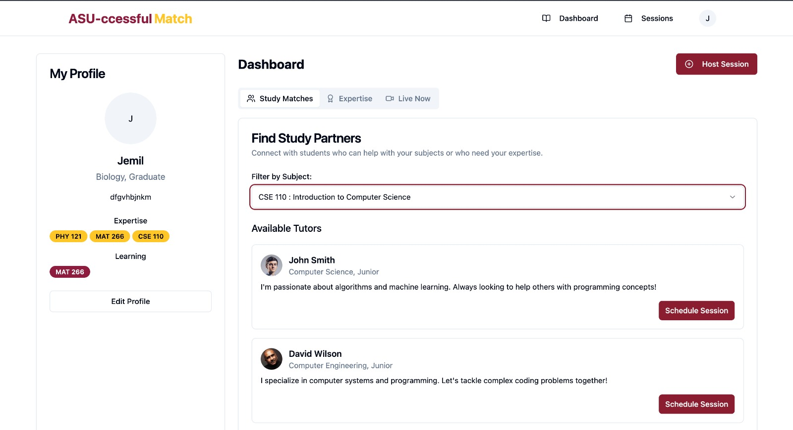
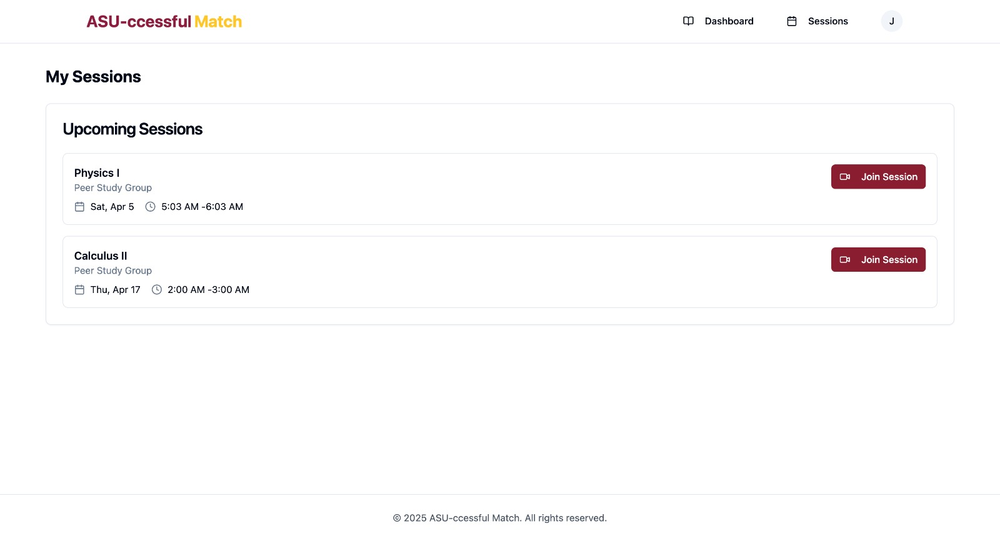
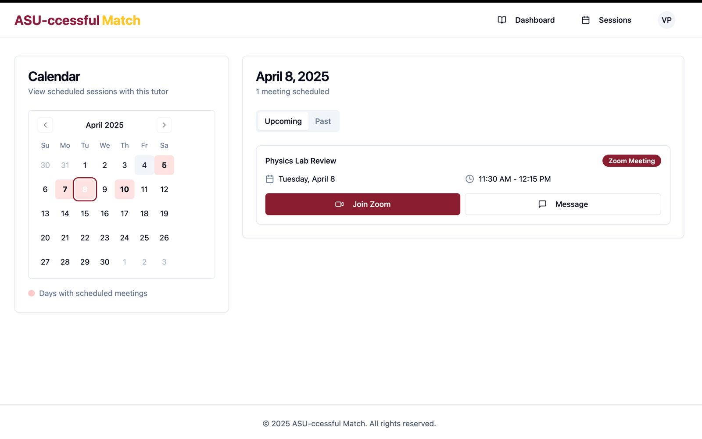
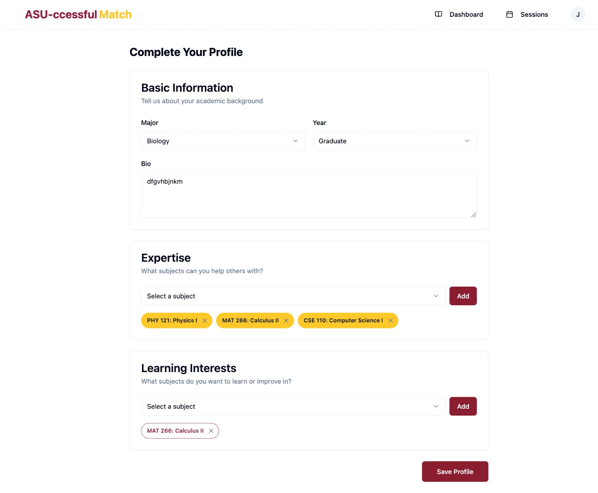

# ASU-ccessful Match - Find Your Perfect Study Partner



## Overview

ASU-ccessful Match is an innovative peer learning platform that connects students with tutors and study groups to enhance their academic performance. Leveraging Zoom's API, ASU-ccessful Match creates a seamless learning environment where students can schedule, join, and manage study sessions with ease.

## Table of Contents

- [Features](#features)
- [Screenshots](#screenshots)
- [Installation](#installation)
- [User Guide](#user-guide)
- [Impact](#impact)
- [Ethical Considerations](#ethical-considerations)
- [Scalability](#scalability)
- [Technical Implementation](#technical-implementation)

## Features

- **Personalized Dashboard**: View upcoming sessions, recommended tutors, and study resources
- **Session Scheduling**: Create and join study sessions with automated Zoom meeting generation
- **Tutor Discovery**: Find and connect with tutors based on subjects and availability
- **Calendar Integration**: Manage your study schedule with an interactive calendar
- **Profile Management**: Showcase your expertise and areas where you need help

## Screenshots

### Home Page
  
*The landing page introduces the platform and its core benefits, with clear calls-to-action for signing up or logging in.*

### Dashboard
  
*Once logged in, students see their personalized dashboard with upcoming sessions, recommended tutors, and quick access to study resources.*

### Session Management
  
*The Sessions page allows students to manage existing sessions, join meetings with one click, and view session details.*

### Calendar View
  
*The Calendar view provides a comprehensive overview of scheduled sessions and available time slots for tutors.*

### Profile Page
  
*The Profile page enables users to showcase their expertise, learning interests, and session history.*


## Installation

### Prerequisites

- Node.js 18+ 
- npm or yarn

### Setup Steps

1. Clone the repository:
   ```bash
   git clone https://github.com/yourusername/ASU-ccessful_Match.git
   cd ASU-ccessful_Match
   ```

2. Install dependencies:
   ```bash
   npm install
   # or
   yarn install
   
   npm install date-fns@3.6.0
   ```

3. Configure environment variables and edit .env with your configuration values

4. Start the development server:
   ```bash
   npm run dev
   # or
   yarn dev
   ```

5. Access the application at `http://localhost:8080`

## User Guide

### Navigation

- **Home**: Access via the logo or home link in the navigation
- **Dashboard**: Your main hub after logging in
- **Sessions**: View and manage your scheduled sessions
- **Calendar**: Interactive calendar view of all sessions
- **Profile**: Update your personal information and preferences

### Creating a Session

1. Go to Dashboard
2. Click "Create New Session"
3. Fill out session details (subject, date/time, description)
4. Click "Create Session"
5. A Zoom meeting link will be automatically generated
6. The session will appear in your Sessions list and Calendar

### Joining a Session

1. Navigate to Sessions or Dashboard
2. Find the session you want to join
3. Click "Join Session" button
4. You'll be redirected to the Zoom meeting

## Impact

### Student Engagement

ASU-ccessful Match dramatically enhances student participation in campus life by:

- **Building Community**: Creating peer connections across different majors and years
- **Breaking Isolation**: Helping remote and commuter students feel connected
- **Skill Sharing**: Encouraging knowledge exchange between students with different strengths
- **Event Discovery**: Promoting study groups and academic events relevant to student interests

### Career Pathways

The platform serves as a powerful career pathway enabler by:

- **Skill Development**: Allowing students to both teach and learn, developing communication skills
- **Networking**: Facilitating connections with peers who share academic and career interests
- **Leadership Opportunities**: Enabling students to lead study sessions and demonstrate expertise
- **Portfolio Building**: Tracking tutoring hours and impact for resume building
- **Discovery**: Exposing students to subjects and career paths they might not have considered

### Reducing Graduation Barriers

ASU-ccessful Match addresses critical barriers to graduation by:

- **Academic Support**: Providing on-demand help for challenging courses
- **Flexible Learning**: Accommodating diverse schedules with asynchronous and synchronous options
- **Early Intervention**: Identifying struggling students through usage patterns
- **Resource Optimization**: Connecting students with the right resources at the right time
- **Community Building**: Creating support networks that increase persistence rates

## Ethical Considerations

ASU-ccessful Match is built with ethical principles at its core:

- **Privacy Protection**: Clear data policies and minimum data collection
- **Accessibility**: Designed for users with diverse needs and abilities
- **Inclusion**: Algorithms designed to avoid bias in recommendations
- **Transparency**: Clear disclosure of how matching and recommendations work
- **User Control**: Students maintain ownership of their data and learning journey

## Scalability

The platform is designed for scalability across multiple dimensions:

- **Institutional**: Easy deployment across multiple departments or campuses
- **Educational**: Framework adaptable to different subjects and learning models
- **Geographic**: Support for both local and global learning communities
- **Temporal**: Accommodates different academic calendars and time zones

## Technical Implementation

ASU-ccessful Match is built using modern web technologies:

- **Frontend**: React with TypeScript, Tailwind CSS, Shadcn UI
- **State Management**: React Query for efficient data fetching
- **Authentication**: Custom auth system with secure token management
- **API Integration**: Seamless integration with Zoom API for meeting creation
- **Responsive Design**: Works on all devices from mobile to desktop

---

Developed by the ASU-ccessful Match Team for the Zoom University Challenge 2025
